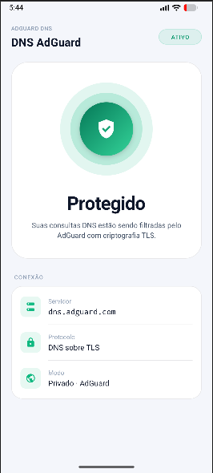

# DNS AdGuard

<p align="center">
  
</p>

A minimal Android app that enables [AdGuard DNS](https://adguard-dns.io) as the system's private DNS, blocking ads and trackers at the network level — no root, no VPN, no manual configuration.

---

## How it works

Android has native support for **DNS over TLS (Private DNS)** since version 9. This app uses the `WRITE_SECURE_SETTINGS` permission to set `dns.adguard.com` directly in the system's global settings, replacing the default DNS resolver.

All DNS traffic is routed through AdGuard, which filters ad and tracker domains before any request is made.

---

## Requirements

- Android 7.0+ (API 24)
- ADB installed on your computer
- USB cable or wireless ADB

---

## Setup

1. Install the APK on your device
2. Run the following ADB command to grant the required permission:

```bash
adb shell pm grant com.fernandot.dnsadguard android.permission.WRITE_SECURE_SETTINGS
```

3. Reopen the app — the button will be available to toggle protection

> `WRITE_SECURE_SETTINGS` cannot be granted by the app itself — this is an Android restriction. ADB is the only way without root.

---

## Usage

- **Tap the orb** to toggle AdGuard DNS on or off
- Status is reflected in real time on the UI
- When disabled, DNS reverts to the system's automatic mode

---

## Permission

| Permission | Reason |
|---|---|
| `WRITE_SECURE_SETTINGS` | Write to Android's global private DNS settings |

No other permissions are requested. The app collects no data, requires no internet access, and touches nothing beyond the DNS settings.

---

## Stack

- Java (Android SDK)
- Material Design 3
- `Settings.Global` API (system private DNS)

---

## License

MIT

```
Copyright (c) 2026 Fernando Lopes Gonçalves Tironi

Permission is hereby granted, free of charge, to any person obtaining a copy
of this software and associated documentation files (the "Software"), to deal
in the Software without restriction, including without limitation the rights
to use, copy, modify, merge, publish, distribute, sublicense, and/or sell
copies of the Software, and to permit persons to whom the Software is
furnished to do so, subject to the following conditions:

The above copyright notice and this permission notice shall be included in all
copies or substantial portions of the Software.

THE SOFTWARE IS PROVIDED "AS IS", WITHOUT WARRANTY OF ANY KIND, EXPRESS OR
IMPLIED, INCLUDING BUT NOT LIMITED TO THE WARRANTIES OF MERCHANTABILITY,
FITNESS FOR A PARTICULAR PURPOSE AND NONINFRINGEMENT. IN NO EVENT SHALL THE
AUTHORS OR COPYRIGHT HOLDERS BE LIABLE FOR ANY CLAIM, DAMAGES OR OTHER
LIABILITY, WHETHER IN AN ACTION OF CONTRACT, TORT OR OTHERWISE, ARISING FROM,
OUT OF OR IN CONNECTION WITH THE SOFTWARE OR THE USE OR OTHER DEALINGS IN THE
SOFTWARE.
```
